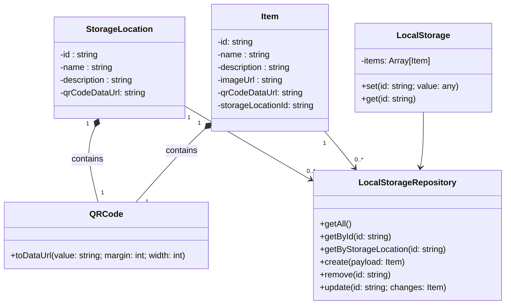

# Class Diagram

### Diagram

![[./../../assets/presentation/Class-Diagram.png]]

### MermaidJS Representation

```mermaid
classDiagram

class Item {
    -id: string
    -name : string 
    -description : string
    -imageUrl : string
    -qrCodeDataUrl: string
    -storageLocationId: string
}

class StorageLocation {
    -id : string 
    -name : string 
    -description : string
    -qrCodeDataUrl: string
}

class QRCode {
    +toDataUrl(value: string; margin: int; width: int)
}

class LocalStorage {
    -items: Array[Item]
    +set(id: string; value: any)
    +get(id: string)
}

class LocalStorageRepository {
    +getAll()
    +getById(id: string)
    +getByStorageLocation(id: string)
    +create(payload: Item)
    +remove(id: string)
    +update(id: string; changes: Item)
}

%% =========================
%% Relationships
%% =========================

Item "1" *-- "1" QRCode : contains
StorageLocation "1" *-- "1" QRCode : contains
LocalStorage --> LocalStorageRepository

Item "1" --> "0..*" LocalStorageRepository
StorageLocation "1" --> "0..*" LocalStorageRepository
```